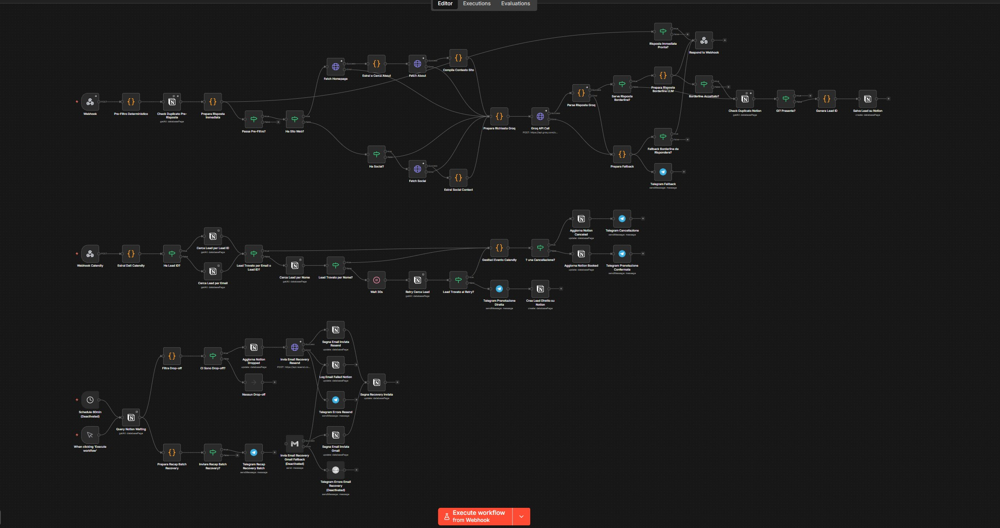

# n8n Lead Qualifier — 65-Node Workflow Demo

**Public portfolio proof for AI automation, workflow orchestration, and agentic operations roles.**

---

## 🇬🇧 English

### What It Does

A self-hosted n8n workflow that automates the full B2B lead pipeline — from first inquiry to CRM update — with zero manual triage.

### The Problem

Every inbound lead required a human to read, classify, score, and route it. Errors, delays, and dropped inquiries were the norm.

### What I Built

A **65-node** n8n workflow running on **Oracle Cloud / PostgreSQL** that:

- **Classifies and scores** inbound leads with **LLM evaluation (Groq)**: relevance, intent, budget signals
- **Routes** inquiries via **email triage**: auto-tags, auto-replies for low-fit leads, priority flags for hot leads
- **Updates the CRM (Notion)** automatically: new lead page, status, score, classification notes
- **Detects duplicates** across multiple intake channels
- **Sends real-time alerts** via **Telegram** for high-priority leads
- **Handles fallback and recovery**: failed LLM calls retry, broken webhooks don't crash the pipeline

### Stack

`n8n` · `PostgreSQL` · `Groq (LLM)` · `Notion API` · `Telegram Bot API` · `Oracle Cloud` · `Docker`

### Screenshot

---

## 🇮🇹 Italiano

### Cosa Fa

Un workflow n8n self-hosted che automatizza l'intera pipeline lead B2B — dal primo contatto all'aggiornamento CRM — senza triage manuale.

### Il Problema

Ogni lead in ingresso richiedeva una persona per leggere, classificare, assegnare un punteggio e instradare. Errori, ritardi e lead persi erano la norma.

### Cosa Ho Costruito

Un workflow n8n da **65 nodi** su **Oracle Cloud / PostgreSQL** che:

- **Classifica e valuta** i lead in ingresso con **LLM (Groq)**: pertinenza, intento, segnali di budget
- **Instrada** le richieste via **triage email**: auto-tag, auto-reply per lead a basso fit, flag di priorità per lead caldi
- **Aggiorna il CRM (Notion)** automaticamente: nuova pagina lead, stato, punteggio, note di classificazione
- **Rileva duplicati** tra più canali di acquisizione
- **Invia notifiche in tempo reale** via **Telegram** per lead prioritari
- **Gestisce fallback e recovery**: chiamate LLM fallite riprovate, webhook rotti non bloccano la pipeline

### Stack

`n8n` · `PostgreSQL` · `Groq (LLM)` · `Notion API` · `Telegram Bot API` · `Oracle Cloud` · `Docker`

### Screenshot

---

## Context

This workflow was originally built and operated in production for **ME3Design** (2024–2026), where it handled live B2B lead intake for an additive manufacturing operation. The screenshot shown here is a sanitized copy of the same architecture, now adapted to run a public portfolio funnel at [aienabledops.it](https://www.aienabledops.it).

---

## Perché è rilevante / Why This Matters

Non è il clone di un tutorial. È un workflow che ha girato in produzione su operazioni aziendali reali — il tipo di automazione end-to-end che questo portfolio esiste per dimostrare.

This isn't a tutorial clone. It's a production workflow that ran daily on live business operations — the kind of end-to-end automation this portfolio exists to prove.
